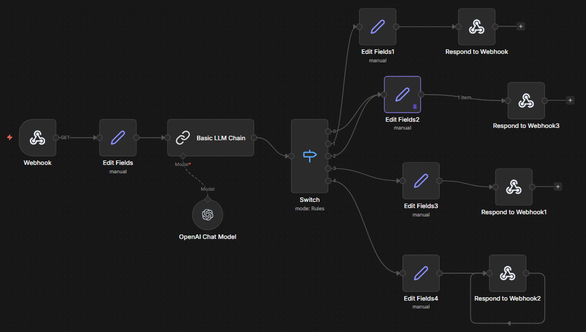

# AI Nutrition Clinic Assistant

AI agent for automating customer service and appointment scheduling in nutrition clinics using n8n and LLMs.

---

# Assistente de Clínica de Nutrição com IA

Agente de Inteligência Artificial para atendimento automatizado em clínicas de nutrição.

## Sobre o projeto

Este projeto consiste em um fluxo de atendimento construído no n8n utilizando modelos de linguagem (LLMs) para representar um assistente virtual capaz de conduzir conversas com pacientes.

A IA é capaz de:
- Identificar a intenção do usuário (valor, agendamento)
- Conduzir o fluxo de atendimento
- Manter o contexto da conversa
- Estruturar um processo de agendamento

## Funcionalidades

- Classificação de intenção com LLM
- Roteamento de fluxo com Switch
- Gestão de estado da conversa (simulada)
- Respostas automatizadas por etapa

## Tecnologias utilizadas

- n8n
- OpenAI (GPT)
- Webhooks

## Fluxo

## Como usar

1. Importe o arquivo `workflow.json` no n8n
2. Configure sua credencial OpenAI
3. Execute o webhook
4. Teste via URL

## Exemplo de uso

GET /webhook?mensagem=quero%20agendar

## Exemplo de conversa

Usuário: Quero saber o valor da consulta  
IA: Nossa consulta tem o valor de R$180 e inclui avaliação completa, plano alimentar personalizado e acompanhamento inicial.

Usuário: Quero agendar  
IA: Perfeito! Você prefere consulta online ou presencial?

Usuário: Online  
IA: Ótimo! Tenho horários disponíveis na terça às 14h ou quinta às 10h. Qual prefere?

## Diferenciais

- Uso de LLM para classificação de intenção
- Arquitetura baseada em automação (n8n)
- Simulação de fluxo real de atendimento
- Estrutura pronta para integração com WhatsApp/API

Esse tipo de solução pode ser aplicado para reduzir carga operacional de atendimento e melhorar a conversão de novos pacientes.
